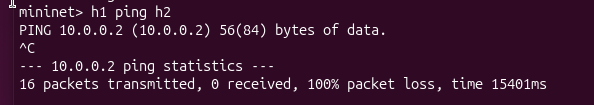
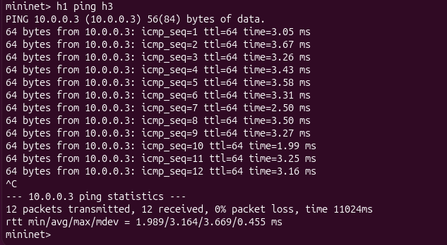
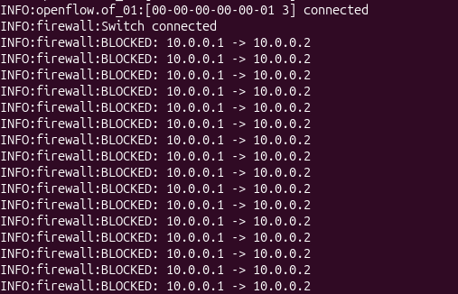
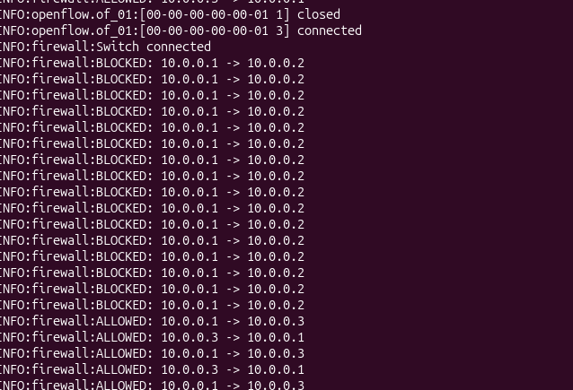
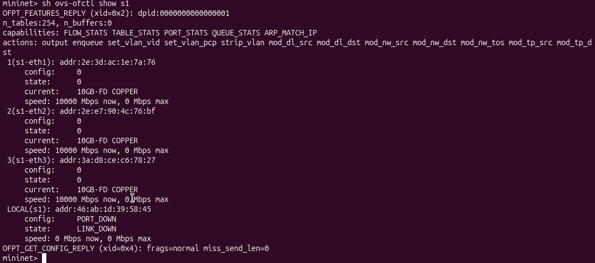

## Proof of Execution

### 1. Blocked Traffic (h1 → h2)
Command:
h1 ping -c 3 h2  
Result: 100% packet loss  

---

### 2. Allowed Traffic (h1 → h3)
Command:
h1 ping -c 3 h3  
Result: Successful communication  

---

### 3. Additional Rule (h2 → h3)
Command:
h2 ping -c 3 h3  
Result: Blocked / Allowed based on rule  

---

### 4. Controller Logs
Shows:
- BLOCKED traffic  
- ALLOWED traffic  

---

### 5. Switch Details (OpenFlow)
Command:
sh ovs-ofctl show s1  

